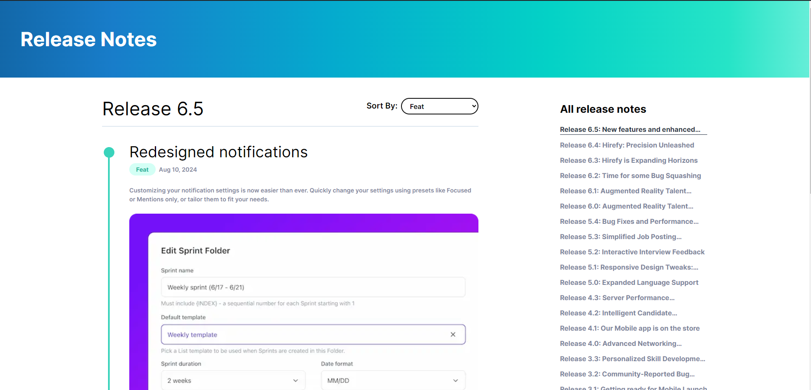

# Challenge-Hirefy

This repository contains the frontend challenge for Hirefy. The project showcases a release notes page for the Hirefy application, allowing users to view and filter release notes by features and fixes.

## Screenshot

## Features

- **Release Notes Display**: View detailed release notes for different versions of the Hirefy application.
- **Filtering**: Filter release notes by features or fixes.
- **Responsive Design**: Optimized for both desktop and mobile views.

## Project Structure

- `app/page.js`: Main page displaying the release notes.
- `app/components/FilterSelect.js`: Component for filtering release notes.
- `app/releases.json`: JSON file containing the release notes data.
- `public/ScreenShot.png`: Screenshot of the project.

## Learn More

To learn more about the technologies used in this project, take a look at the following resources:

- [React Documentation](https://reactjs.org/docs/getting-started.html) - learn about React features and API.
- [Next.js Documentation](https://nextjs.org/docs) - learn about Next.js features and API.
- [Tailwind CSS Documentation](https://tailwindcss.com/docs) - learn about Tailwind CSS utility-first framework.

As requested for this challenge the entirety of this project, including deploy, was done within 4 hours so there's always room for improvement.
